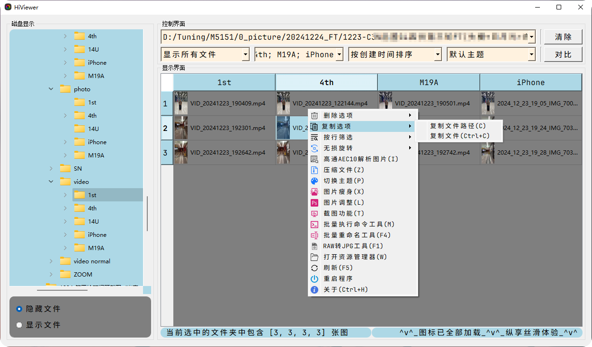
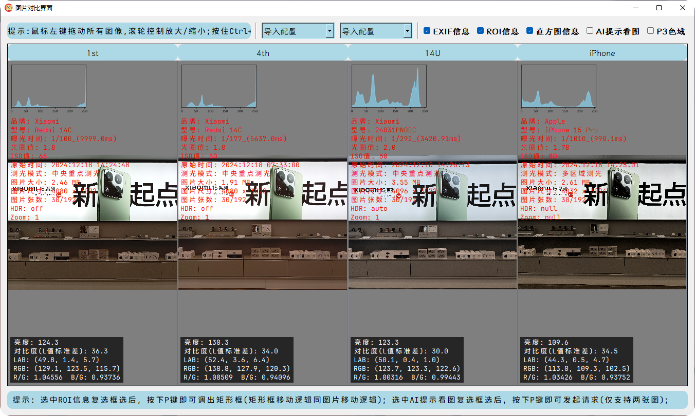

<p align="right">
   <strong>Chinese</strong> | <a href="./README.en.md">English</a>
</p>

<div align="center">

# 📷 hiviewer


**hiviewer** is an **intelligent image viewer tool** that supports **image & video** comparison. This project is implemented using **Python + PyQt5**, providing users with a more convenient way to view images.

<p align="center">
  <a href="https://www.python.org/">
    
  </a>
  <a href="https://platform.openai.com/">
    
  </a>
  <a href="https://raw.githubusercontent.com/yourusername/xianyubot/main/LICENSE">
    
  </a>
</p>

</div>

## Project Structure

```

hiviewer_root/
├── src/                # Contains the main functional modules of the project
│   ├── __init__.py
│   ├── modules/        # Contains sub-interface functional modules
│   │   ├── __init__.py
│   │   ├── sub_bat.py
│   │   ├── sub_compare_image_view.py
│   │   ├── sub_compare_video_view.py
│   │   ├── sub_image_process.py
│   │   ├── sub_image_size_reduce.py
│   │   └── sub_rename_view.py
│   ├── ui/             # Contains the main interface and image viewing sub-interface UI
│   │   ├── __init__.py
│   │   ├── main_ui.py
│   │   └── sub_ui.py
│   └── utils/          # Contains custom functional modules
│       ├── __init__.py
│       ├── about.py
│       ├── AI_tips.py
│       ├── Custom_dialog_class.py
│       ├── Custom_Font_class.py
│       ├── hisnot.py
│       ├── installer.py
│       ├── mipi2raw.py
│       └── update.py
├── test/               # Contains test code
│   ├── __init__.py
│   └── test_utils_about.py
├── icons/              # Contains ico icons
├── docs/               # Contains documentation
├── fonts/              # Contains custom fonts
├── tools/              # Contains some exe tools
├── .gitignore          # Ignore files
├── README.md           # Documentation
├── requirements.txt    # Third-party library dependencies
└── hiviewer.py         # Main function of the project

```

## Usage Instructions

### Environment Setup

```bash
# Install dependencies
pip3 install -r requirements.txt

# Run the program
python3 hiviewer.py
```

### Download Installer

#### Windows Users

1. Download the "[latest.zip](https://github.com/diamond-cz/Hiviewer_releases/releases/)" archive
2. After extraction, double-click the "hiviewer.exe" program to run

#### macOS Users

Not currently maintained

### Demo

> New versions will have new changes. This is for reference only. For detailed usage instructions, please click [here](https://github.com/diamond-cz/hiviewer_releases). It's not a hassle `-_-)o`

**Main Interface Demo**




**Image Viewing Interface Demo**



**Video Playback Interface Demo**


### Technical Implementation


## License

This project is licensed under **GPL 3.0** ([GNU General Public License](https://jxself.org/translations/gpl-3.zh.shtml)), allowing free use and modification, but the modified source code must be made public.
For more details, please refer to the [LICENSE](LICENSE) file.

[](https://jxself.org/translations/gpl-3.zh.shtml)
