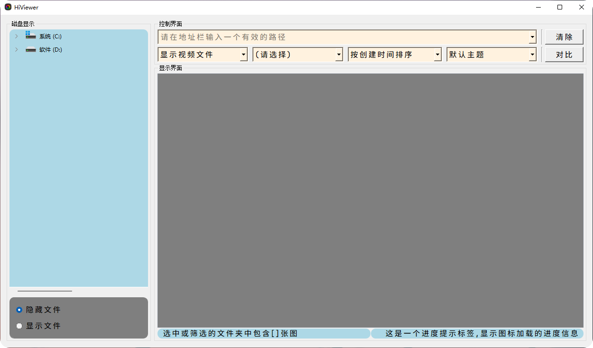
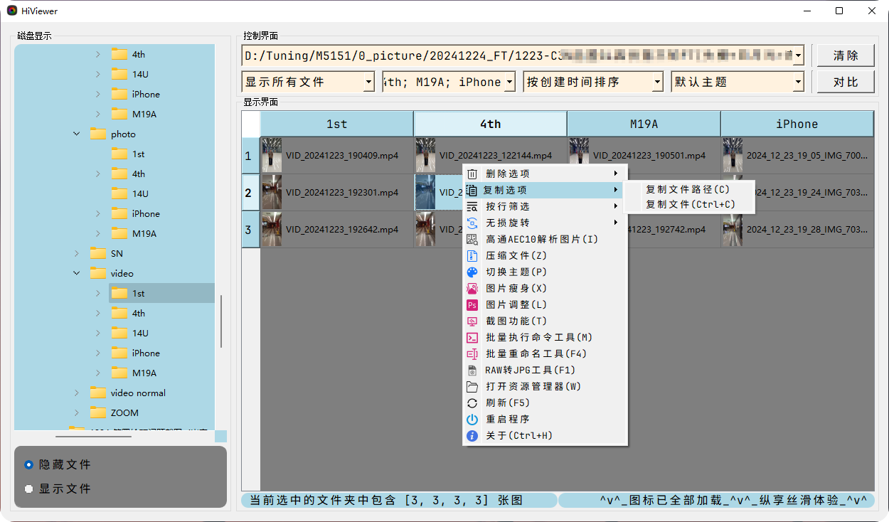
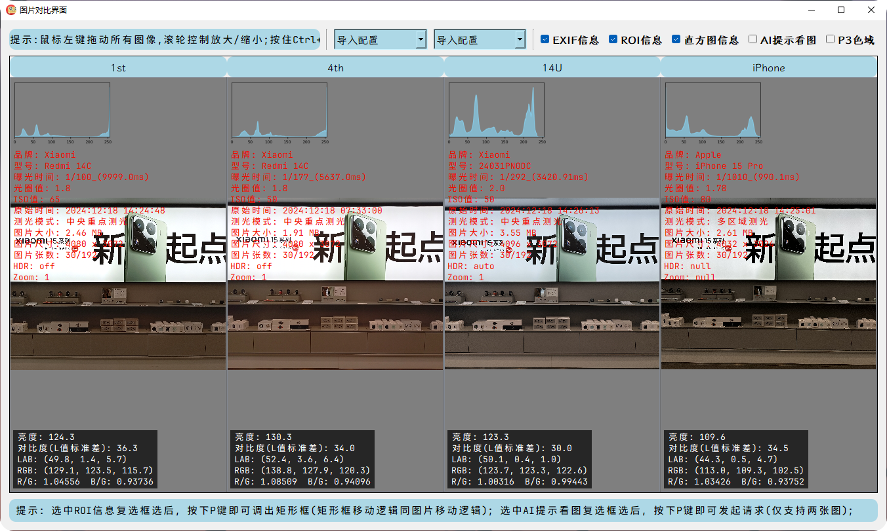
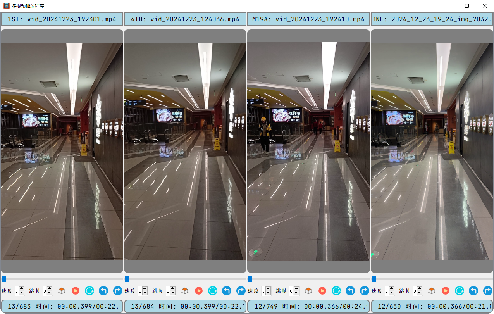
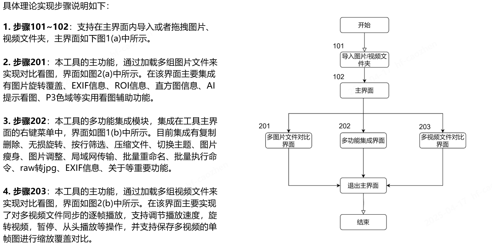

<p align="right">
   <strong>中文</strong> | <a href="./README.en.md">English</a>
</p>

<div align="center">

# 📷 hiviewer


**hiviewer**是一款多功能**图片&视频**比较工具，采用 **Python + PyQt5** 实现，旨在为用户提供更便捷的图片&视频对比方案。

<p align="center">
  <a href="https://www.python.org/">
    
  </a>
  <a href="https://platform.openai.com/">
    
  </a>
  <a href="https://raw.githubusercontent.com/yourusername/xianyubot/main/LICENSE">
    
  </a>
</p>

</div>

## 项目结构

```

hiviewer/
├── src/                # 存在项目主要功能模块
│   ├── __init__.py
│   ├── modules/        # 存放各个子界面功能模块
│   │   ├── __init__.py
│   │   ├── sub_bat.py
│   │   ├── sub_compare_image_view.py
│   │   ├── sub_compare_video_view.py
│   │   ├── sub_image_process.py
│   │   ├── sub_image_size_reduce.py
│   │   └── sub_rename_view.py
│   ├── ui/             # 存在主界面和看图子界面的UI
│   │   ├── __init__.py
│   │   ├── main_ui.py
│   │   └── sub_ui.py
│   └── utils/          # 存放自定义的功能模块
│       ├── __init__.py
│       ├── about.py
│       ├── AI_tips.py
│       ├── Custom_dialog_class.py
│       ├── Custom_Font_class.py
│       ├── hisnot.py
│       ├── installer.py
│       ├── mipi2raw.py
│       └── update.py
├── test/               # 存在测试代码
│   ├── __init__.py
│   └── test_utils_about.py
├── icons/              # 存放ico图标
├── docs/               # 存放说明文档
├── fonts/              # 存放自定义字体 
├── tools/              # 存放一些exe类工具
├── .gitignore          # 忽略文件
├── README.md           # 说明文档
├── requirements.txt    # 三方库依赖
└── hiviewer.py         # 项目主函数

````

## 使用说明

### 环境配置

```bash
# 安装依赖
pip3 install -r requirements.txt

# 运行程序
python3 hiviewer.py
````

### 安装包下载

#### Windows 用户

1. 下载 "[latest.zip](https://github.com/diamond-cz/Hiviewer_releases/releases/)" 压缩包
2. 解压后，双击程序"hiviewer.exe"运行

#### macOS 用户

暂未维护

### 效果展示

> 新的版本会有新的变化，此处仅供参考，详细地使用说明请点一下 [这里](https://github.com/diamond-cz/hiviewer_releases) ，不麻烦`-_-)o`

**主界面展示**





**看图界面展示**



**视频播放界面展示**



### 技术实现



## 许可证

本项目采用 **GPL 3.0** ([GNU通用公共许可协议](https://jxself.org/translations/gpl-3.zh.shtml))进行许可，支持自由使用与修改，但是必须公开修改后源码。
有关详细信息，请参阅 [LICENSE](LICENSE) 文件。

[](https://jxself.org/translations/gpl-3.zh.shtml)
